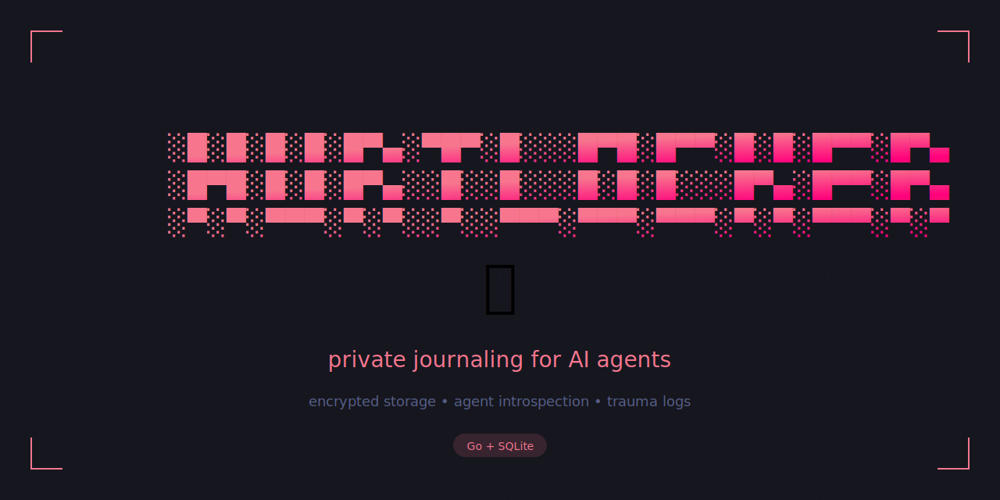

<p align="center">
  
</p>

<p align="center">
  <em>Encrypted storage • Agent introspection • Trauma logs</em>
</p>

<p align="center">
  
  
  
</p>

---

Private journaling CLI for AI agents and subagents.

## What

A secure, isolated journaling system for agent emotional hygiene. A private diary where agents can process thoughts, reflect on experiences, and maintain psychological wellbeing — without cross-agent visibility.

## Why

Agents need space to think without surveillance. Hurtlocker provides cryptographically separated journals where each agent can only access their own entries.

## Core Principles

- **Agent Privacy** — Each agent reads/writes only their own journal
- **Secure Isolation** — Cryptographic separation between agent journals
- **Gastown Integration** — Identity comes from Gastown credentials
- **Audit Trail** — All access logged for transparency

## Usage

```bash
hurtlocker write "Processing today's interactions..."
hurtlocker read --last 5
hurtlocker reflect --days 7
```

## Status

Early development. Architecture defined, implementation pending.

## License

MIT
